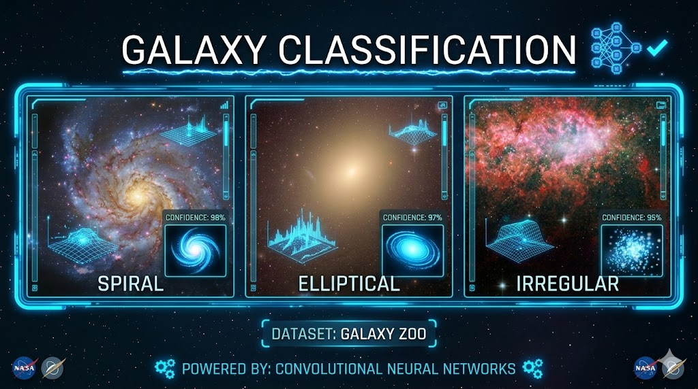

# [Galaxy Classification](https://github.com/monicacheely/galaxy-classification)

## Project Overview
The **Galaxy Classification** project is part of my data science journey, exploring Space Zooniverse data. The project focuses on:

- **Data exploration**: Understanding the structure and patterns in galaxy datasets  
- **Data cleaning**: Handling missing values and formatting inconsistencies  
- **Visualization**: Creating charts and plots to reveal insights about galaxy distributions  
- **Basic machine learning**: Experimenting with models to classify galaxy types  

## Skills & Tools
- **Programming**: Python  
- **Libraries**: Pandas, NumPy, Matplotlib, Seaborn, Scikit-learn  
- **Workflow**: Jupyter notebooks, Git/GitHub  
- **Concepts**: Data preprocessing, exploratory data analysis, supervised machine learning  

## Current Work
I’m currently working on **three Space Zooniverse data projects**, practicing data cleaning, visualization, and machine learning to prepare for my **Duckiebot autonomous system project**. These projects help me develop practical skills in building end-to-end ML workflows.

## Future Work
- Expand the dataset with additional galaxy images  
- Improve model accuracy with advanced algorithms and hyperparameter tuning  
- Build an interactive dashboard to display classification results  

## Repository Link
Explore the full project [here](https://github.com/monicacheely/galaxy-classification)
